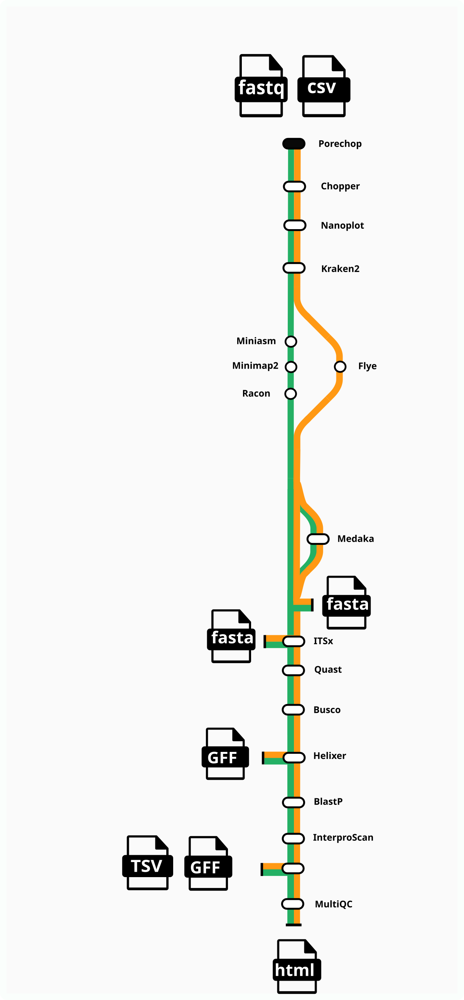
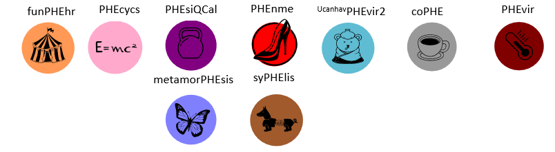

#  


## Introduction

**nf-funphehr** (pronounced fun-fair) is a bioinformatics pipeline that can be used to analyse Nanopore sequencing data obtained from fungal isolates. It takes a samplesheet and fastq files as input, performs QC, trimming, assembly, assembly QC and annotation(in dev). This is the public version of the pipeline being developed at SA Pathology. Please note annotation processes still in development.  


1. Trim adapters ([`FastQC`](https://www.bioinformatics.babraham.ac.uk/projects/fastqc/))
2. Trim low quality and short reads ([`chopper`](https://github.com/wdecoster/chopper))
3. Present QC of reads post trimming ([`Nanoplot`](https://github.com/wdecoster/NanoPlot))
4. Screen reads for contamination ([`kraken2`](https://github.com/DerrickWood/kraken2))
5. Denovo Assembly
   - flye ([`flye`](https://github.com/fenderglass/Flye))
   OR 
   - miniasm -> minimap2 -> racon 
   ([`miniasm`](https://github.com/lh3/miniasm))
   ([`minimap2`](https://github.com/lh3/minimap2))
   ([`racon`](https://github.com/lbcb-sci/racon))

6. Polishing reads (optional) ([`medaka`](https://github.com/nanoporetech/medaka))
7. Extract of ITS1-5.8S-ITS2 region ([`ITSx`](https://microbiology.se/software/itsx/))
8. Assembly assessment report ([`QUAST`](http://quast.sourceforge.net/quast))
9. Assembly quality ([`BUSCO`](https://busco.ezlab.org/))
10. Structural annotation using deep neural network ([`Helixer`](https://github.com/weberlab-hhu/Helixer))
11. Functional annotation using interproscan([`Interproscan`](https://github.com/ebi-pf-team/interproscan))
12. Functional annotation using blastP 
13. Merge annotations into single gff (**[`agat_sp_manage_functional_annotation.pl`](https://github.com/NBISweden/AGAT)) **(custom script in development still to replace this perl script)
14. Present metrics from run ([`MultiQC`](http://multiqc.info/))


## Usage

First, prepare a samplesheet with your input data that looks as follows:

`samplesheet.csv`:

```csv
ID,LongFastq,GenomeSize, species
231862455,./data/S1_long_fastq.gz,14.0m,"Candida albicans"
231495562,./data/S1_long_fastq.gz,26.0m,"Candida parapsilosis"
NEG, ./data/NEG_1.fastq.gz,,
```

Each row represents a fastq file (single-end) of long reads.
Any line with ID NEG will not have stop before assembly. kraken2 used to screen contamination of the run negative control. 

Now, you can run the pipeline using:

<!-- TODO nf-core: update the following command to include all required parameters for a minimal example -->

```bash
nextflow run https://github.com/SAP-PHE-Bioinformatics/FunPHEhr/ \
   -profile <docker/apptainer/singularity/...> \
   --input samplesheet.csv \
   --outdir <OUTDIR>
```

:::warning
Please provide pipeline parameters via the CLI or Nextflow `-params-file` option. Custom config files including those
provided by the `-c` Nextflow option can be used to provide any configuration _**except for parameters**_;
see [docs](https://nf-co.re/usage/configuration#custom-configuration-files).
:::

** Please not nextflow.config file may need to be have paths updated for databases for kraken2, busco and for annotation steps. 


## Citations

This pipeline was built using nextflow and following nf-core template. 

An extensive list of references for the tools used by the pipeline can be found in the [`CITATIONS.md`](CITATIONS.md) file.

You can cite the `nf-core` publication as follows:

> **The nf-core framework for community-curated bioinformatics pipelines.**
>
> Philip Ewels, Alexander Peltzer, Sven Fillinger, Harshil Patel, Johannes Alneberg, Andreas Wilm, Maxime Ulysse Garcia, Paolo Di Tommaso & Sven Nahnsen.
>
> _Nat Biotechnol._ 2020 Feb 13. doi: [10.1038/s41587-020-0439-x](https://dx.doi.org/10.1038/s41587-020-0439-x).

Acknowledgement to all the authors of tools used within the pipeline. 

* __[chopper](https://github.com/wdecoster/chopper)__  
Rust implementation of NanoFilt+NanoLyse, both originally written in Python. This tool, intended for long read sequencing such as PacBio or ONT, filters and trims a fastq file.
_Wouter De Coster, Rosa Rademakers, [NanoPack2: population-scale evaluation of long-read sequencing data](https://doi.org/10.1093/bioinformatics/btad311, Bioinformatics, (2023)_  

* __[Flye](https://github.com/fenderglass/Flye)__  
De novo assembler for single molecule sequencing reads using repeat graphs  
_Kolmogorov, M, Yuan, J, Lin, Y, Pevzner, P, [Assembly of Long Error-Prone Reads Using Repeat Graphs](https://doi.org/10.1038/s41587-019-0072-8), Nature Biotechnology, (2019)_  

* __[Minimap2](https://github.com/lh3/minimap2)__  
A versatile pairwise aligner for genomic and spliced nucleotide sequences  
_Li, H [Minimap2: pairwise alignment for nucleotide sequences.](https://doi.org/10.1093/bioinformatics/bty191) Bioinformatics, 34:3094-3100. (2018)_  

* __[Miniasm](https://github.com/lh3/miniasm)__  
Ultrafast de novo assembly for long noisy reads (though having no consensus step)  
_Li, H [Miniasm: Ultrafast de novo assembly for long noisy reads](https://doi.org/10.1093/bioinformatics/btw152) Bioinformatics, Volume 32, Issue 14 (2016) _  

* __[Medaka](https://github.com/nanoporetech/medaka)__  
Sequence correction provided by ONT Research  
_Li, H [Medaka: Sequence correction provided by ONT Research](https://github.com/nanoporetech/medaka)_  

* __[Porechop](https://github.com/rrwick/Porechop)__  
Adapter trimmer for Oxford Nanopore reads  
_Wick, RR, Judd, LM, Gorrie, CL, Holt, KE, [Completing bacterial genome assemblies with multiplex MinION sequencing.](https://doi.org/10.1099/mgen.0.000132) Microb Genom. 3(10):e000132 (2017)_  

* __[Quast](https://github.com/ablab/quast)__  
taxonomic sequence classifier that assigns taxonomic labels to DNA sequences
_Alla Mikheenko, Andrey Prjibelski, Vladislav Saveliev, Dmitry Antipov, Alexey Gurevich, [Versatile genome assembly evaluation with QUAST-LG](https://doi.org/10.1093/bioinformatics/bty266) Bioinformatics 34 (13): i142-i150 (2018)_  

* __[BUSCO](https://busco.ezlab.org/)__  
Evaluating the quality of genomic data
_Mosè Manni, Matthew R Berkeley, Mathieu Seppey, Felipe A Simão, Evgeny M Zdobnov, [C BUSCO Update: Novel and Streamlined Workflows along with Broader and Deeper Phylogenetic Coverage for Scoring of Eukaryotic, Prokaryotic, and Viral Genomes](https://doi.org/10.1093/molbev/msab199) Molecular Biology and Evolution (2021)_  

* __[kraken2](https://github.com/DerrickWood/kraken2)__  
Taxonomic sequence classifier that assigns taxonomic labels to DNA sequences
_Wood, D.E., Lu, J. & Langmead, B. [Improved metagenomic analysis with Kraken 2](https://doi.org/10.1186/s13059-019-1891-0) Genome Biol 20, 257 (2019)_  

* __[Racon](https://github.com/lbcb-sci/racon)__  
Ultrafast consensus module for raw de novo genome assembly of long uncorrected reads  
_Vaser, R, Sović, I, Nagarajan, N, Šikić, M, [Fast and accurate de novo genome assembly from long uncorrected reads.](http://dx.doi.org/10.1101/gr.214270.116) Genome Res. 27, 737–746 (2017)._  

* __[InterProScan](https://github.com/ebi-pf-team/interproscan)__  
Ultrafast consensus module for raw de novo genome assembly of long uncorrected reads  
_Jones, P, Binns, D, Chang,H, Fraser, M, Li,W, McAnulla,C, McWilliam, H, Maslen, J, Mitchell, A,  Nuka, G, Pesseat, S,  Quinn, A, Sangrador-Vegas, A, Scheremetjew, M, Yong, S, Lopez, R, Hunter, S[InterProScan 5: genome-scale protein function classification](https://doi.org/10.1093/bioinformatics/btu031) Bioinformatics, Volume 30, Issue 9, May 2014, Pages 1236–1240._  

* __[Blastp](https://github.com/NBISweden/AGAT)__  
BlastP simply compares a protein query to a protein database
_Camacho C., Coulouris G., Avagyan V., Ma N., Papadopoulos J., Bealer K., Madden T.L. [BLAST+: architecture and applications.](https://www.ncbi.nlm.nih.gov/pubmed/20003500?dopt=Citation) BMC Bioinformatics 10:421. ._  

* __[AGAT](https://github.com/NBISweden/AGAT)__  
Suite of tools to handle gene annotations in any GTF/GFF format.
_Dainat J. [AGAT: Another Gff Analysis Toolkit to handle annotations in any GTF/GFF format](https://www.doi.org/10.5281/zenodo.3552717) Zenodo ._  


## Pipline name
Context for the name of this pipeline, the name funPHEhr orginates from Lex Leong, Genomic Lead of the SA Pathology Public Health and Epidemiology Lab. He has a challenge to get the abbrevation of our Lab (PHE) into all the names of our pipelines. This pipeline was not immune and has been given the name funPHEhr where the logo for this pipeline is a fair/fete tent as seen below in image of the SA Path PHE pipelines. You can try and work our the other pipeline names using the logos.

